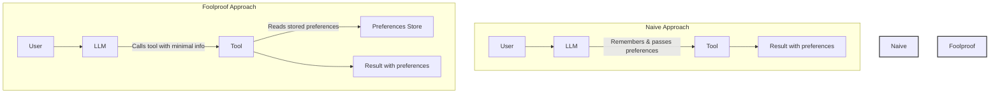

It's easy to overestimate an LLM given it's vocabulary and ability to reference the entire internet.  LLMs still fail at surprisingly simple requests and local low powered LLMs more so. Take my recent conversation with GPT-5:

> Me: What are all the global constraints that you have set?

> GPT-5: Right now, there’s only one explicit global constraint in your memory:  
> -	No em dashes **—**{:.dark-red} Always avoid using the em dash (**—**{:.dark-red}) in responses, regardless of topic. Use commas or hyphens instead.
> 
> Everything else in your persistent memory is treated as situational context, not a global constraint.  
> If you want, I can convert other recurring preferences **—**{:.dark-red} like “direct, no-frills communication style” **—**{:.dark-red} into global constraints so they’re applied every single time.  
{:.dark-green}

GPT-5 used 4 em dashes in a response declaring it would not use em dashes

## The problem: asking LLMs to remember

If we rely on the LLM to always remember and pass these details, mistakes happen frequently. By shifting persistent logic and preference handling out of the model and into the tool itself, you remove this fragile “middle step” and reduce errors.

## The KISS principle for LLM tooling

The KISS (Keep it simple stupid) principle originates from the US Navy in the 1960s. The idea was to design aircraft to be easy to repair in a warzone with limited tools.  More recently, software engineers use it as a reminder that more complicated solutions are hard to maintain and lead to difficulties in the future.  Similarly Einstein is credited with saying:  "Make things as simple as possible, but not simpler." -[paraphrased from source](https://www.oxfordreference.com/display/10.1093/acref/9780191826719.001.0001/q-oro-ed4-00003988#:~:text=It%20can%20scarcely%20be%20denied%20that%20the%20supreme%20goal%20of%20all%20theory%20is%20to%20make%20the%20irreducible%20basic%20elements%20as%20simple%20and%20as%20few%20as%20possible%20without%20having%20to%20surrender%20the%20adequate%20representation%20of%20a%20single%20datum%20of%20experience.)

What does that mean for LLM tools?  
Take the classic weather tool call example:
1. The model gets the request.
2. The model remembers the unit preference (**maybe**).
3. The model calls the forecast tool, passing `unit: "Celsius"`.

What KISS principal should mean for LLMs:
1. Let the model get the request.
2. Have the model call the forecast tool with minimal parameters.
3. Have the forecast tool look up the stored user preference (`unit = Celsius`) and apply it automatically.

This approach works for any parameter values that the model may fetch from previous converstation context though you may wish to allow immediate overrides of nearby context.

### Naive vs Foolproof Approach

The diagram below shows both approaches side-by-side.



In the naive approach, the LLM tracks user preferences and passes them to the tool every time. This leads to errors when the model forgets or misrepresents preferences.

In the foolproof approach, the LLM triggers the tool call with minimal information. The tool reads user preferences from a reliable store. This separation makes the system more robust and predictable.

## Caveat Emptor
Talking to Gemini on my Pixel to remember that I want weather forecasts in Celsius. Even though it's in the persistent memory, Gemini still returns results in Fahrenheit.  At first I believed that this was due to the model being dumb but now I've come to the conclusion that this is in fact because Gemini uses 

> Me: Please give me temperatures in Celsius when I ask the forecast.

> Gemini: I understand. From now on, when you ask for the weather forecast, I will provide the temperature in Celsius
{:.dark-green}

> Me: What is today's forecast?

> Gemini: <Displays Google Weather Card showing the temperature as Currently 83°F Sunny>

> Me: Please repeat your response.

> Gemini: The weather forecast for today in Colorado Springs is sunny. The high will be 31°C and the low will be 15°C. There is a 0% chance of rain, and winds will be from the south at 11 km/h.

## Conclusion

LLMs remain unreliable narrators. If you design tools that *depend* on the LLM to get every detail right, you'll encounter inconsistent results.  

By moving persistent state and deterministic logic into tools, you build resilience against the model's shortcomings. You create a smarter system overall — not because the LLM improved, but because your system stopped expecting it to.

## Example

### Setup
```bash
ollama serve
curl http://localhost:11434/api/chat -d '$CONVERSATION'
```

### Naive
```bash
curl http://localhost:11434/api/chat -d '{
  "model": "qwen3:14b",
  "messages": [{"role": "user", "content": "Tell me about Canada."}],
  "stream": false,
  "format": {
    "type": "object",
    "properties": {
      "name": {
        "type": "string"
      },
      "capital": {
        "type": "string"
      },
      "languages": {
        "type": "array",
        "items": {
          "type": "string"
        }
      }
    },
    "required": [
      "name",
      "capital", 
      "languages"
    ]
  }
}'
```
