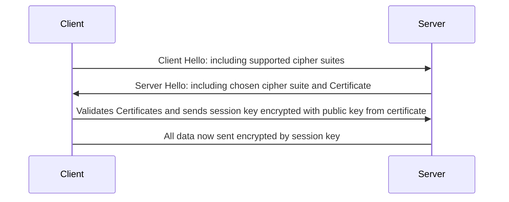
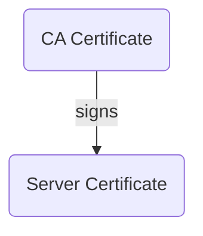

Most web servers employ TLS certificates to client as the basis for secure encrypted communications and to establish trust between the server and client.

A client receives the certificate as part of the first message from the Server and will use the certificate to validate that it is indeed talking to the server and to encrypt the initial exchange of encryption keys.



- The public key part of public/private encryption key pair that will allow the client to encrypt early communication with the sever and establish a mutual trust.
- A chain of trusted signed/encrypted certificates that serve to link the current serve to a trusted authority through successive signing of certificates.

## Generating a certificate chain


### Start with a self-signed root certificate
```zsh
# Generate private key and csr
openssl req -new -newkey rsa:2048 -nodes -out ca.csr -keyout ca.key \
    -subj "/CN=ca.localhost" 

# Self sign the csr to generate a pem
openssl x509 -trustout -signkey ca.key -days 7 -req -in ca.csr -out ca.pem
```

Results in the following files(`tree`)

{:.left}
```
.
├── ca.csr
├── ca.key
└── ca.pem
```

ca.csr
: The Certificate Request contains the public part of encryption protocol used by the client to encrypt messages which the server will decrypt.

ca.key
: The private key.  This is important to keep safe and a secret as it is the only way for the server to decrypt messaged encrypted using the public key.

ca.pem
: We sign the public part of key `csr` to give the client some assurance of the certificates origin.  This certificate, like most certificates issued by root Certificate Authorities (CAs), is self-signed.  
    
{:.clear}
The client will have have a list of trusted CA certificates obtained out-of-band of the current request.  Comparing the csr with the pem
```zsh
diff -U 9999 --label="ca.csr" --label="ca.pem" \
    <(openssl req -text -noout -verify -in ca.csr) \
    <(openssl x509 -in ca.pem -text -noout) 
```

```diff
--- ca.csr
+++ ca.pem
@@ -1,47 +1,51 @@
-Certificate Request:
+Certificate:
     Data:
         Version: 1 (0x0)
+        Serial Number:
+            08:90:11:4a:4d:33:90:a3:83:f4:f7:52:40:64:07:11:ef:b2:9c:64
+        Signature Algorithm: sha256WithRSAEncryption
+        Issuer: CN = ca.localhost
+        Validity
+            Not Before: Oct 23 20:45:17 2023 GMT
+            Not After : Oct 30 20:45:17 2023 GMT
         Subject: CN = ca.localhost
         Subject Public Key Info:
             Public Key Algorithm: rsaEncryption
                 Public-Key: (2048 bit)
                 Modulus:
                     00:da:89:cd:3d:00:96:e6:30:27:b7:9c:4d:ab:e3:
                     64:93:b6:f2:e1:a9:da:1a:b3:5e:0b:f7:1f:d2:60:
                     0c:65:d1:01:bc:b3:2e:04:9b:74:f7:66:a9:c9:c2:
                     1a:bf:fc:9e:e6:5e:8f:1a:3c:4c:2c:8c:4b:97:7c:
                     54:e0:23:eb:20:25:be:7f:8b:50:de:8f:1e:c8:6b:
                     39:45:09:b4:88:93:47:0f:33:f0:b0:1b:9f:ae:c3:
                     75:f4:01:e3:fe:42:3e:43:93:ea:80:7c:58:57:1b:
                     cd:f6:1e:d2:42:01:b1:32:ec:73:d1:c2:b9:50:34:
                     7f:9b:8d:58:2a:37:b5:85:46:80:6d:f7:55:62:dd:
                     00:0c:64:e0:fb:8c:95:c4:3b:59:54:2a:d0:78:3c:
                     84:09:7b:fc:47:9e:2a:24:30:ba:69:be:a9:2a:61:
                     43:95:71:07:e7:3f:71:61:f5:92:de:c9:1e:89:5c:
                     95:1c:f4:49:6a:a0:8e:bf:11:69:54:91:7a:3f:b0:
                     d0:9e:5a:06:e1:65:77:4b:de:d9:99:84:6b:8d:c7:
                     8a:5f:7a:7f:0a:e7:7f:9a:36:45:83:43:25:3b:85:
                     03:ac:11:c0:7d:84:9e:e2:4a:37:a0:ad:2c:11:b2:
                     23:3f:21:82:83:5c:9e:a1:68:24:78:2b:cc:ad:c4:
                     01:bd
                 Exponent: 65537 (0x10001)
-        Attributes:
-            (none)
-            Requested Extensions:
     Signature Algorithm: sha256WithRSAEncryption
     Signature Value:
-        a1:71:d8:63:c1:b1:e7:11:18:b7:55:32:a4:49:20:6c:2e:ad:
-        e9:e3:fd:c7:de:2e:9b:30:bb:5e:56:76:55:04:87:8a:35:60:
-        0f:cc:80:33:ab:1b:9a:f2:1f:34:4c:98:61:5b:36:0c:f4:ab:
-        f5:96:7f:27:a5:ca:d8:bf:42:4a:3a:a5:1b:f2:ac:6c:82:e3:
-        86:9d:15:78:e9:e6:fb:fd:93:f7:da:3e:8b:80:3e:0b:4c:16:
-        ec:fa:a9:fa:31:49:87:5f:a5:c7:e4:4f:3d:ad:af:30:3d:7e:
-        38:08:0e:65:4b:21:ff:a6:f7:19:06:46:d4:88:ea:c2:6b:b9:
-        6e:83:b8:74:db:fd:27:47:04:f4:92:d4:e6:96:7a:fe:87:ec:
-        08:e0:70:c4:9c:89:fa:42:ef:46:53:9c:9c:47:4e:10:0e:e2:
-        77:4a:95:12:54:6a:29:3f:b2:f9:ec:1c:ef:03:2e:57:32:35:
-        89:39:32:6e:f3:ff:b5:41:a0:fc:bb:55:99:71:68:b8:87:6d:
-        31:cf:0d:61:d9:89:80:c3:79:f1:f5:f6:8e:37:e1:ec:b0:7f:
-        f6:e1:87:6c:f8:86:4c:6a:7d:3c:cd:13:33:bb:1c:08:9d:9e:
-        f5:09:e8:bb:bf:95:fe:ab:7d:a8:d4:8c:db:3a:9d:2c:cd:9e:
-        ab:8b:8c:ff
+        54:79:97:6d:58:81:39:ed:39:40:78:e8:43:e3:bc:df:ac:75:
+        5b:91:90:b7:86:18:19:8b:e6:31:9d:ab:77:3c:fa:fa:52:0d:
+        e5:58:ec:e5:5e:2d:70:91:ec:e6:56:a7:4f:df:60:3b:f2:fa:
+        b0:bf:59:cf:d8:57:54:eb:bb:f9:99:ec:69:41:92:ff:32:3e:
+        45:63:b2:7d:22:62:82:81:86:3b:b7:1c:91:f9:f2:9b:fb:bb:
+        91:db:e2:d5:bf:de:bf:eb:e1:ee:98:be:20:6d:9b:79:19:8e:
+        ea:59:7b:5a:d9:85:02:21:09:26:1b:32:15:ba:5d:f9:25:87:
+        10:15:93:a3:0a:ec:0b:55:47:e4:3d:44:94:2b:90:de:9e:94:
+        79:79:9d:8a:8e:70:cd:64:32:fc:76:94:f4:bb:f1:38:30:48:
+        14:20:25:4c:29:94:2d:89:2d:6f:29:37:53:81:d3:ce:e6:be:
+        1f:81:0d:52:2a:d6:d9:16:d7:dd:fa:0b:96:e4:ba:56:bb:cb:
+        9e:00:07:a1:56:4a:5d:3d:c6:f3:8a:9f:0e:fb:5e:b4:2a:cd:
+        55:af:73:72:27:f8:28:86:ff:73:d2:06:6a:74:89:49:31:65:
+        b3:af:a7:64:d0:40:77:50:e9:df:b6:ff:6a:53:87:13:8a:86:
+        89:f0:5a:33
```

### Creating a certificate chain
A certificate chain contains the public key 
```zsh
# Generate new private key and csr for a
openssl req -new -newkey rsa:2048 -nodes -out a.csr -keyout a.key \
    -subj "/CN=localhost" \
    -addext "subjectAltName=DNS:localhost,IP:127.0.0.1"

# Sign it 
openssl x509 -trustout -CA ca.pem -CAkey ca.key -days 7 -req -in a.csr -out a.pem

```
A call on `tree` reveals similar, private key (`a.key`), certificate request(`a.csr`) and the resulting certificate chain (`a.pem`).  

{:.right}
```
.
├── a.csr
├── a.key
├── a.pem
├── ca.csr
├── ca.key
└── ca.pem

1 directory, 6 files
```

a.csr
: The Certificate Request which contains the public key will be signed with the certificate from a root ca: `ca.pem`

a.key
: The private key.

a.pem
: Once a Certificate request is signed by a 
Note that the certificate chain contains the ca.pem in it's tail:

{:.clear}

Both certificate files must be sent together as part of a certificate chain.  We can test the validity of new certificate with openssl verification.
`openssl verify -CAfile ca.pem a.pem`

Or we can test the certificates by opening a test server up:
```zsh
echo test > test
openssl s_server -status_verbose -accept 4443 -WWW -cert <(cat a.pem ca.pem) -key a.key
```

`curl -vvi https://localhost:4433/test --cacert ca.pem`

```
*   Trying 127.0.0.1:4433...
* Connected to localhost (127.0.0.1) port 4433 (#0)
* ALPN: offers h2,http/1.1
* (304) (OUT), TLS handshake, Client hello (1):
*  CAfile: ca.pem
*  CApath: none
* (304) (IN), TLS handshake, Server hello (2):
* (304) (IN), TLS handshake, Unknown (8):
* (304) (IN), TLS handshake, Certificate (11):
* (304) (IN), TLS handshake, CERT verify (15):
* (304) (IN), TLS handshake, Finished (20):
* (304) (OUT), TLS handshake, Finished (20):
* SSL connection using TLSv1.3 / AEAD-CHACHA20-POLY1305-SHA256
* ALPN: server did not agree on a protocol. Uses default.
* Server certificate:
*  subject: CN=localhost
*  start date: Oct 23 20:46:30 2023 GMT
*  expire date: Oct 30 20:46:30 2023 GMT
*  common name: localhost (matched)
*  issuer: CN=ca.localhost
*  SSL certificate verify ok.
* using HTTP/1.x
> GET /test HTTP/1.1
> Host: localhost:4433
> User-Agent: curl/8.1.2
> Accept: */*
> 
* HTTP 1.0, assume close after body
< HTTP/1.0 200 ok
HTTP/1.0 200 ok
< Content-type: text/plain
Content-type: text/plain

< 
test
* Closing connection 0
```

## Resources
- http://web.archive.org/web/20100504162138/http://www.ibm.com/developerworks/java/library/j-certgen/)
- https://www.xolphin.com/support/OpenSSL/Frequently_used_OpenSSL_Commands)
- https://stackoverflow.com/questions/10175812/how-to-generate-a-self-signed-ssl-certificate-using-openssl)
- https://jamielinux.com/docs/openssl-certificate-authority/introduction.html)
- https://medium.com/@organicprogrammer/how-https-works-part-three-the-anatomy-of-certificate-dc7ad5f208bf)
- https://www.openssl.org/docs/man1.1.1/man1/x509.html)
- https://www.openssl.org/docs/man1.1.1/man1/openssl-req.html)
- https://help.mulesoft.com/s/article/How-to-set-up-a-minimal-SSL-TLS-server-from-the-command-line
- https://medium.com/@superseb/get-your-certificate-chain-right-4b117a9c0fce
- https://superuser.com/questions/126121/how-to-create-my-own-certificate-chain
- https://jamielinux.com/docs/openssl-certificate-authority/create-the-root-pair.html
- https://linuxconfig.org/testing-https-client-using-openssl-to-simulate-a-server
- https://www.ssl.com/article/ssl-tls-handshake-ensuring-secure-online-interactions/
