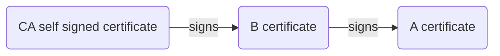

Almost all web servers employ TLS/SSL certificates to users as the basis for secure, encrypted and trust between the server.

A client will use the servers provided certificate as:
- The public key part of public/private encryption key pair that will allow the client to encrypt its communication with the sever.
- A chain of trusted signed/encrypted certificates that serve to link the current serve to a trusted authority through successive signing of certificates.

## Generating a certificate chain


### Start with a self-signed root certificate
```zsh
# Generate private key and csr
openssl req -new -newkey rsa:2048 -nodes -out ca.csr -keyout ca.key \
    -subj "/CN=localhost" -addext "subjectAltName=DNS:localhost,IP:127.0.0.1"

# Self sign the csr to generate a pem
openssl x509 -trustout -signkey ca.key -days 7 -req -in ca.csr -out ca.pem
```

Results in the following files(`tree`)

{:.left}
```
.
├── ca.csr
├── ca.key
└── ca.pem
```

ca.csr
: The Certificate Request is usually given to a ceriticate authority to sign

ca.key
: The private key.  This is important to keep safe and a secret as it is the only way to decrypt messaged encrypted using the certificate

ca.pem
: Once a Certificate request is signed it becomes a pem

{:.clear}
Comparing the csr with the pem
```zsh
diff -U 9999 --label="ca.csr" --label="ca.pem" \
    <(openssl req -text -noout -verify -in ca.csr) \
    <(openssl x509 -in ca.pem -text -noout) 
```

```diff
--- ca.csr
+++ ca.pem
@@ -1,47 +1,50 @@
-Certificate Request:
+Certificate:
     Data:
-        Version: 0 (0x0)
+        Version: 1 (0x0)
+        Serial Number:
+            be:a5:f2:d1:34:4f:2e:97
+    Signature Algorithm: sha256WithRSAEncryption
+        Issuer: CN=localhost
+        Validity
+            Not Before: Jun 17 08:28:39 2023 GMT
+            Not After : Jun 24 08:28:39 2023 GMT
         Subject: CN=localhost
         Subject Public Key Info:
             Public Key Algorithm: rsaEncryption
                 RSA Public-Key: (2048 bit)
                 Modulus:
                     00:d6:d2:cb:52:2c:ed:76:fb:d9:6d:3a:df:1f:f9:
                     0c:69:bb:e9:6c:18:bb:33:07:59:30:22:ac:0a:73:
                     65:c5:2d:be:57:ef:8f:24:23:2a:48:42:3d:31:b2:
                     c5:bb:10:6b:64:c5:eb:85:42:ae:53:01:c3:a2:60:
                     32:24:8f:67:44:67:c8:31:d1:b9:a6:be:f3:9b:cc:
                     d6:6e:a4:57:00:6b:2e:8b:f9:d3:b8:20:50:e0:ff:
                     3b:0a:aa:7f:23:cc:d7:a2:25:b0:9f:b3:04:9a:36:
                     91:61:43:a5:b8:d3:5c:28:57:12:bf:a6:00:51:98:
                     11:08:72:d3:cd:88:ad:7e:0b:90:cf:eb:83:23:0f:
                     9e:59:e7:0e:a3:7f:a4:71:d3:3f:82:55:a4:5b:dd:
                     10:c8:1d:97:b1:83:05:74:b8:a1:ac:c1:73:63:fe:
                     f8:20:1e:b4:d1:a8:a6:e6:06:d6:13:29:07:ad:b1:
                     a8:89:b4:ad:a7:54:44:57:df:65:99:20:58:3c:6c:
                     1f:e9:9e:87:35:17:4f:c6:31:bb:1e:83:a4:79:c8:
                     65:d4:ba:4d:9f:b9:24:43:6d:75:ea:ee:75:06:3a:
                     8a:a8:5a:54:bd:62:1d:d2:ed:ab:1f:02:36:68:11:
                     59:71:05:86:d1:95:6d:d9:5f:94:59:8d:66:a7:6c:
                     53:2b
                 Exponent: 65537 (0x10001)
-        Attributes:
-        Requested Extensions:
-            X509v3 Subject Alternative Name: 
-                DNS:localhost, IP Address:127.0.0.1
     Signature Algorithm: sha256WithRSAEncryption
-         49:99:37:3e:50:bc:d2:02:f5:03:a9:34:04:3a:13:f7:4a:8d:
-         1e:c6:82:0e:15:7f:00:12:0d:04:fd:4d:9e:a7:3f:0a:3d:84:
-         1c:41:6e:9c:c7:2b:bd:78:86:5f:27:49:84:49:81:0d:04:26:
-         ad:75:61:1d:22:ff:47:17:ce:ef:6e:d0:c5:a3:86:46:06:8e:
-         3a:47:cc:a6:b6:a9:70:41:89:b0:24:a6:48:63:21:a1:ae:09:
-         1b:68:15:41:4d:71:99:b3:a2:bb:14:88:0f:03:76:e0:d4:e4:
-         66:74:8f:95:12:5d:22:ae:09:0a:8b:37:bd:8f:25:be:6f:ec:
-         f0:e6:f4:49:9c:75:ec:7d:e3:e3:8e:cb:57:64:4e:47:0d:8b:
-         b5:c2:8b:8d:f3:3b:17:ae:e5:44:a2:39:74:79:39:93:16:77:
-         53:45:fc:1b:1a:20:1d:00:d7:8f:11:07:69:50:3e:af:1b:a7:
-         64:d8:5c:f0:60:3b:5d:0e:d7:85:94:06:2d:53:94:d6:87:1d:
-         e5:6d:7d:c7:b5:de:ba:b2:43:21:13:c1:c1:32:d3:86:20:55:
-         78:b3:7f:6b:d8:8c:c6:52:ea:ed:b2:9a:bd:94:17:91:1e:f7:
-         f0:3b:33:54:d2:22:4a:6a:6e:a1:f3:e7:3d:34:68:c2:5c:a8:
-         7c:02:68:74
+         6a:bd:91:2d:ce:15:90:b9:9d:aa:99:7f:0d:1a:04:b4:f2:81:
+         3d:55:56:eb:25:a1:da:bf:4b:ae:fa:e4:38:9a:d7:d6:6b:13:
+         3e:58:52:a3:5b:af:dd:1e:88:b3:f2:08:93:9a:db:4a:a1:e8:
+         d8:f5:f1:ef:14:f5:c8:d0:7e:b2:b7:4c:59:ab:04:fa:00:7e:
+         2d:c1:fb:d1:bc:04:92:e3:d1:ec:74:6d:5a:15:98:ea:3a:dd:
+         9d:82:cf:5c:67:8c:5b:d8:1d:c9:0a:9d:59:09:5c:60:f8:6b:
+         4a:59:8b:9c:41:8b:89:83:2f:ba:93:fc:96:b3:a7:f2:60:7b:
+         07:92:d8:64:96:66:e2:82:d4:a9:c0:48:4f:e4:e2:a9:18:87:
+         b4:5d:d3:d1:b4:54:c8:99:cf:da:c9:f9:69:3d:3a:ee:a6:d0:
+         05:46:1c:99:35:b4:61:62:a1:f5:94:ea:91:62:89:c4:ab:56:
+         15:a7:30:cf:17:ae:47:04:a9:11:ed:b0:12:19:d9:db:3a:80:
+         2f:7f:c0:ab:80:75:4b:c0:e8:14:7d:01:fe:9d:32:bc:57:62:
+         64:11:e3:79:1e:4d:0a:7d:1d:3b:ce:f8:8a:47:3c:50:2a:f0:
+         51:11:80:91:05:ce:bc:e8:18:22:a7:3f:64:e3:4a:a2:a2:4e:
+         df:1a:6e:39

```

### Certificate A is created like this:
```zsh
# Generate new private key and certificate
openssl req -new -newkey rsa:2048 -nodes -out a.csr -keyout a.key \
    -subj "/CN=a.localhost" -addext "subjectAltName=DNS:a.localhost,IP:127.0.0.1"

# Sign it 
openssl x509 -trustout -CA ca.key -days 7 -req -in a.csr -out a.pem
```

{:.left}
```
.
├── a.csr
├── a.key
├── a.pem
├── ca.csr
├── ca.key
└── ca.pem
```

A call on `tree` reveals similar, private key (`a.key`), certificate request(`a.csr`) and the resulting certificate chain (`a.pem`)

Comparing the csr with the pem
```zsh
diff -U 9999 --label="ca.pem" --label="a.pem" \
    <(openssl x509 -in ca.pem -text -noout) \
    <(openssl x509 -in ca.pem -text -noout)
```


## Root Certificate


[1]: (http://web.archive.org/web/20100504162138/http://www.ibm.com/developerworks/java/library/j-certgen/)
[2]: (https://www.xolphin.com/support/OpenSSL/Frequently_used_OpenSSL_Commands)
[3]: (https://stackoverflow.com/questions/10175812/how-to-generate-a-self-signed-ssl-certificate-using-openssl)
[4]: (https://jamielinux.com/docs/openssl-certificate-authority/introduction.html)
[5]: (https://medium.com/@organicprogrammer/how-https-works-part-three-the-anatomy-of-certificate-dc7ad5f208bf)