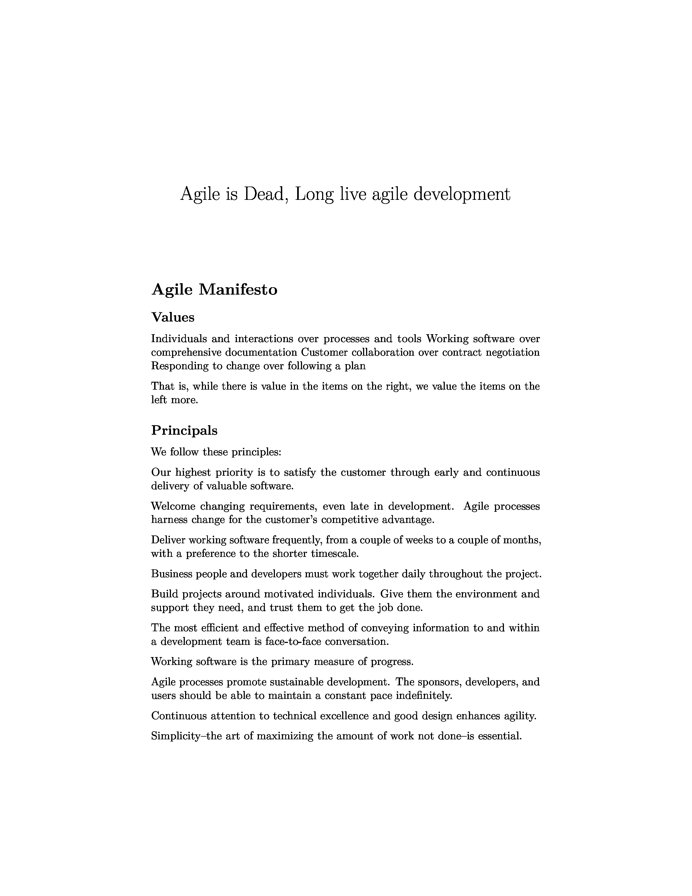
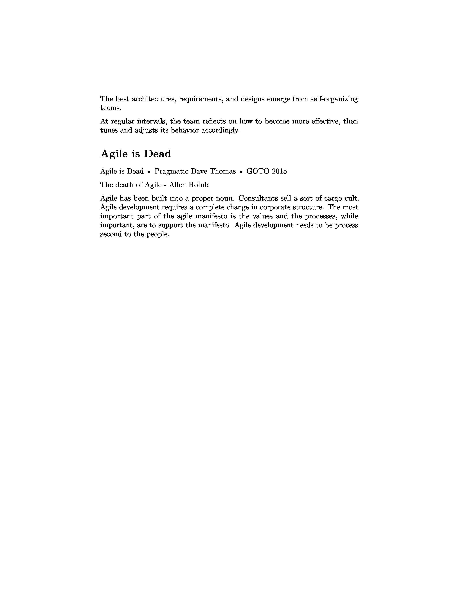

We are going to be taking a markdown text document.  Rendering it to a pdf.  Converting it to a png.  Converting it to a grayscale png and then applying ocr to get the text.  This is almost a loop

## Setup

```zsh
brew install pandoc basictex imagemagick tesseract
eval "$(/usr/libexec/path_helper)"
```


## Rendering a PDF
```zsh
cd ocr
pandoc ../_posts/2023-03-05-ways-of-working.md \
    -o ways-of-working.pdf \
    --include-in-header=<(echo "\pagenumbering{gobble}")
```

<object data="../ocr/ways-of-working.pdf" type="application/pdf" width="100%" height="700px">
    <embed src="../ocr/ways-of-working.pdf">
        <p>This browser does not support PDFs. Please download the PDF to view it: <a href="http://yoursite.com/the.pdf">Download PDF</a>.</p>
    </embed>
</object>

## Convert it to a high quality grayscale image
```zsh
convert -density 300 -type Grayscale ways-of-working.pdf ways-of-working-%d.png
```



## Read the image
```zsh
cat \
    <(tesseract -l eng ways-of-working-0.png -) \
    <(tesseract -l eng ways-of-working-1.png -) \
> ways-of-working.txt 
```

<object data="../ocr/ways-of-working.txt" type="text/plain" width="100%" height="700px">
    <a href="../ocr/ways-of-working.txt">No Support?</a>
</object>
