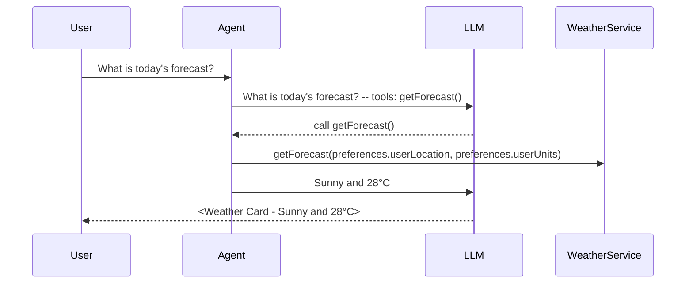

I am building my own CLI based agent and believe the easiest and most efficient way to make LLMs more reliable is to embed traditional code into the workflow.  Not to say that there is no value in making models more reliable, but that it is cheaper to develop and run reliable code than it is to train and execute more reliable models.  We can do that by removing the models ability to make mistakes by offloading the work into [tool/function calls](https://platform.openai.com/docs/guides/function-calling) where we can lean on traditional Software Engineering techniques for reliability.

I just had a conversation with [Gemini](https://gemini.google.com/app) about using my prefferred units(Celsius) which has forced me to rethink this: 

> Me: Please give me temperatures in Celsius when I ask the forecast.

> Gemini: I understand. From now on, when you ask for the weather forecast, I will provide the temperature in Celsius
{:.dark-green}

> Me: What is today's forecast?

> Gemini: 
{:.dark-green}

More from this conversation in a moment, but first I want to point out that this is the sort of reliability that I wish to address with function calls.  Gemini has disregarded my request for Celsius but adding to my confusion, the LLM must have made a function call to discover what the actual temperature is.  So... what is going wrong and why has a function call resulted in a less reliable experience?  

Well let me show you the rest of the conversation:

> Me: Please repeat your response.

> Gemini: The weather forecast for today in Colorado Springs is sunny. The high will be 31°C and the low will be 15°C. There is a 0% chance of rain, and winds will be from the south at 11 km/h.
{:.dark-green}

At first I believed that the LLM was forgetting my Celsius preference while making a function call. We can see, however, that the Gemini model(2.5 Flash) is responding correctly while the App has overlayed a Weather Forecast Card which ignores the model's response.

My take-aways from this experience: we **can make models more reliable by leaning on functions** but we need to be careful when we introduce external code into the mix and we should keep the models aware of the results.  The flow I would use is something like this:

