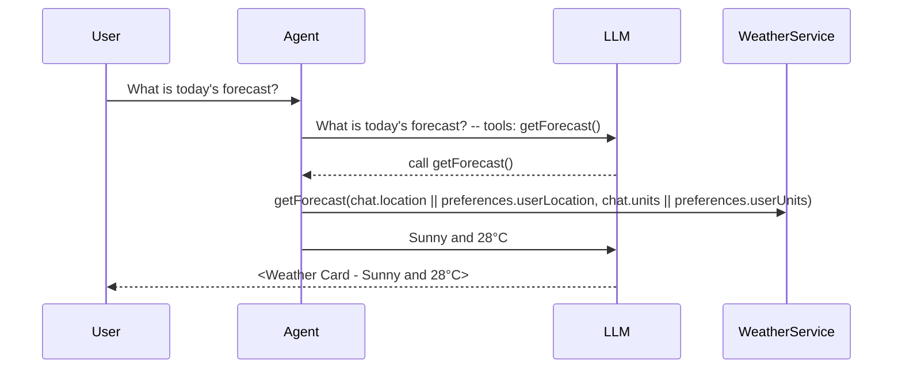

I’m building my own CLI-based agent, and I think that the easiest and most efficient approach to increasing reliablility is to introduce traditionaly coded tools into the workflow. This isn’t to say that improving model reliability has no value, but it’s cheaper and more predictable to develop and improve the reliability of code than it is to train and execute more reliable models.

We can achieve this by removing the opportunity for the model to make mistakes and offload the work into [tool/function calls](https://platform.openai.com/docs/guides/function-calling), where traditional software engineering techniques can ensure correctness.

I recently ran into an example while asking [Gemini](https://gemini.google.com/app) for the forecast in my preferred units (Celsius) which requires some discussion: 

> Me: Please give me temperatures in Celsius when I ask the forecast.

> Gemini: I understand. From now on, when you ask for the weather forecast, I will provide the temperature in Celsius
{:.dark-green}

> Me: What is today's forecast?

> Gemini: 
{:.dark-green}

At first glance, it appears that Gemini has disregarded my request for Celsius when it made a function for the weather forecast but more is at play.

Continuing the conversation:

> Me: Please repeat your response.

> Gemini: The weather forecast for today in Colorado Springs is sunny. The high will be 31°C and the low will be 15°C. There is a 0% chance of rain, and winds will be from the south at 11 km/h.
{:.dark-green}

It appears that while the LLM responded correctly, the Gemini App overlaid a forecast card which ignored the model’s output. 

The key takeaways:
- Leverage functions to offload logic that the LLM might get wrong.
- Ensure the model and function calls are operating on the same data.

Function calls don’t magically solve all reliability issues, but when done carefully, they can dramatically reduce errors and make LLMs more predictable.
