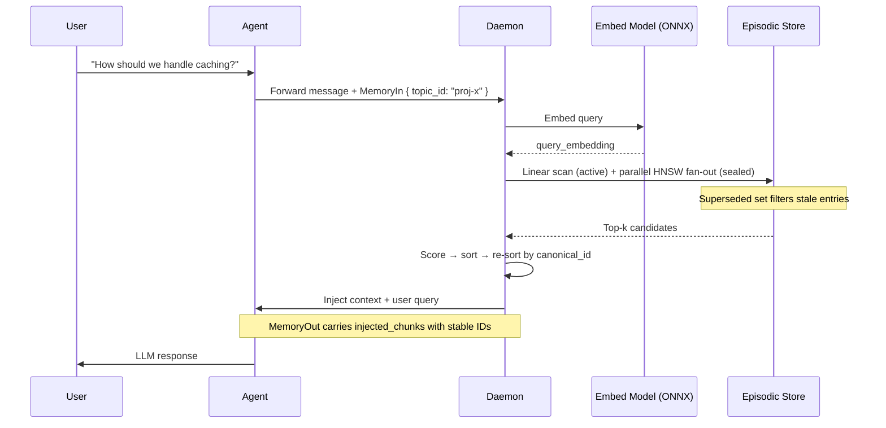
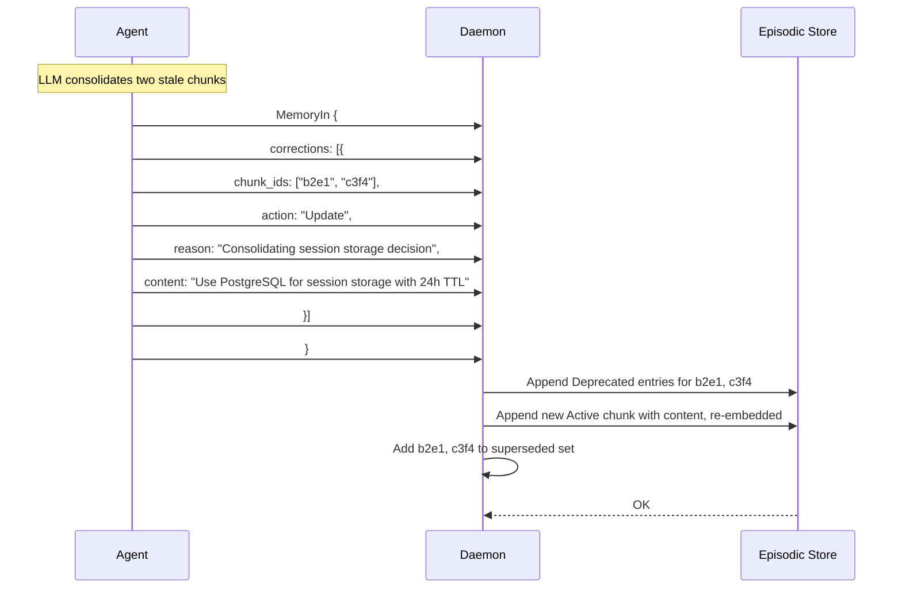
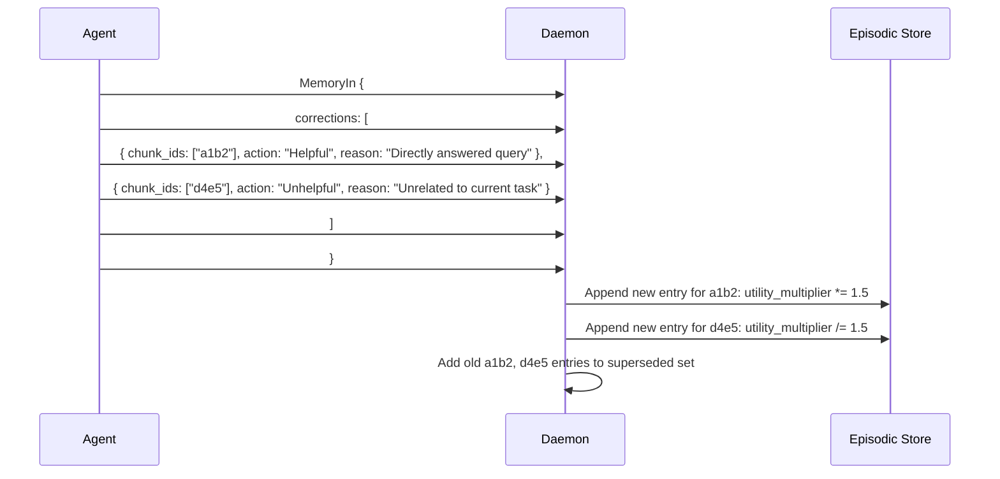
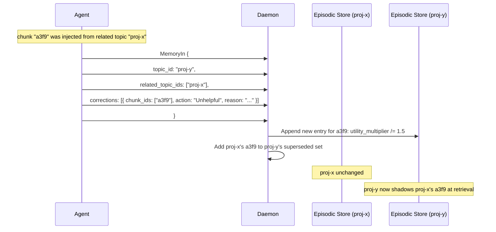
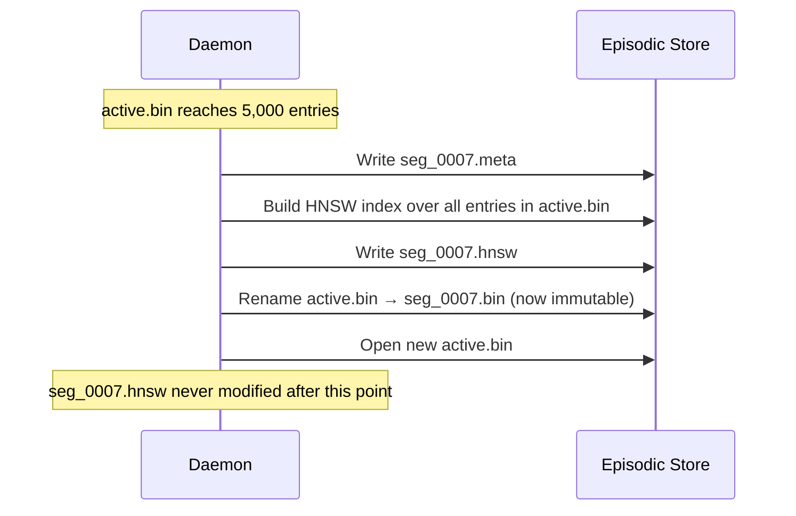
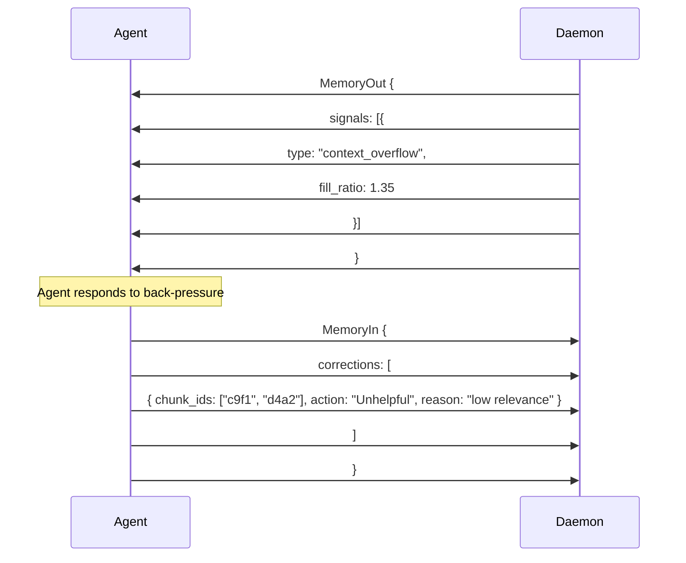

I've been desinging with some LLM collaboration an agent context memory manager for use with the Agent I'm building.

# Design Document

## Project Overview

**Goal:** A long-running, local Rust daemon acting as transparent memory middleware for a TypeScript AI agent. It manages an "Infinite Context Window" for local LLMs (llama.cpp) by combining an append-only segmented log with per-segment HNSW indexes for fast, correct semantic retrieval.

**Core Philosophy:** The daemon sits transparently between the agent and the LLM, managing memory implicitly. It is intentionally simple and fast — it does not perform inference beyond embedding. All semantic judgments (contradiction detection, relevance assessment) are the responsibility of external callers who communicate back via the correction mechanism. The daemon is correctable, not intelligent.

**Simplicity Priority:** Client interface simplicity is the highest goal, followed by internal implementation simplicity. Changes that complicate the client interface are not justified by internal gains.

**Invariant:** The daemon never deletes or mutates stored content. All state evolution occurs through append-only events.

---

## System Architecture

- **Communication:** IPC via UNIX sockets / standard streams using a JSON-Lines (JSONL) protocol. Framing markers guard against partial reads on mid-write crashes.
- **Data Format:** Strictly adheres to the standard LLM message interface (`role`, `content`, `tool_calls`), extended with `memory_in` and `memory_out` sideband fields.
- **Inference Dependency:** Exactly one local ONNX model — `all-MiniLM-L6-v2` (~90MB) for chunk embedding. No main LLM involvement in memory operations. No network calls.
- **Safety/Logging:** All internal daemon logging uses `stderr` (`eprintln!`) to prevent corruption of the JSONL data stream.

---

## Memory Layers Overview

The daemon manages two active memory layers. These are logical roles, not a storage hierarchy — the terms "tier" and "level" are intentionally avoided to prevent confusion with WAL storage concepts.

| Layer | Name | Storage | Purpose |
|---|---|---|---|
| **Hot Buffer** | Rolling Buffer | In-process RAM | Live conversation window; compacted into the Episodic Store when full |
| **Episodic Store** | Segmented Append-Only Log | Binary segment files + HNSW indexes on disk | The sole source of truth; all chunks, all corrections, full history |

Retrieval is stateless — there is no in-memory promoted set, no frequency index, and no derived state beyond the superseded set that requires reconciliation at startup.

---

## WAL-Style Append-Only Semantics

The Episodic Store is an **append-only log**. Entries are never mutated in place. Corrections — deprecations, updates, utility adjustments — are written as new log entries with the same logical chunk ID but a higher `canonical_id`.

At read time, if a chunk ID appears in multiple segments, **only the entry with the highest `canonical_id` is used**. Earlier entries for the same ID are superseded and excluded from retrieval.

Consequences:

- **Sealed segments are truly immutable.** No in-place writes ever occur on sealed segment files or their HNSW indexes.
- **Crash recovery is trivial.** The log is always consistent; only partial writes at the tail of the active segment require recovery.
- **Full audit history is preserved.** Deprecated or updated content remains in the log and is recoverable.

---

## The Superseded Set

Correctness of append-only retrieval is maintained by an in-memory **superseded set** — a `HashSet<Uuid>` of every chunk ID that has been overridden by a newer entry anywhere in the log.

**The superseded set is always rebuilt from the log at startup.** Segments are scanned newest-to-oldest; any chunk ID encountered in a newer segment is added to the set, and its older occurrences are thereby superseded. The scan terminates per chunk ID as soon as a superseding entry is found, so in practice the scan is fast — recent corrections are in recent segments. At query time, candidates are filtered against the set in O(1) per lookup.

The log is the sole source of truth. Persisting the superseded set would introduce a second source of truth that can drift from the log, adding a failure mode that requires a fallback rebuild path anyway. Rebuild at startup is the simpler and always-correct approach. If corpus size eventually makes startup rebuild time noticeable, persistence is a straightforward optimization to add at that point (see Roadmap).

```
memory/
  {topic_id}/
    segments/
      seg_0001.bin
      seg_0001.meta
      seg_0001.hnsw    # built at seal time, never modified
      seg_0002.bin
      seg_0002.meta
      seg_0002.hnsw
      ...
    active.bin         # current write target; linear scan only
    active.meta
    # no superseded.bin — always derived from the log at startup
```

---

## Physical Compaction — Optional Maintenance Only

With HNSW indexes and the superseded set handling correctness and performance, physical compaction — rewriting segment files to remove superseded entries — is **not a required correctness mechanism**. It is an optional maintenance operation that reduces HNSW index size when the superseded rate within a segment becomes large enough to meaningfully affect search cost.

HNSW search scales as O(log N) in indexed vectors. A segment with a 40% superseded rate searches a graph roughly 1.7× larger than a fully compacted equivalent — a modest constant factor, not a pathological degradation. Physical compaction is deliberately out of scope for v1.

---

## Topic Scoping

Every message is scoped to a **topic** — a named, fully isolated Episodic Store log with its own segment files, HNSW indexes, and superseded set.

- `topic_id` is optional. If absent, the daemon routes to the reserved `"default"` topic.
- `related_topic_ids` allows read-only retrieval from additional topics in the same turn.
- **Topics are created implicitly** on first use.

---

## Cross-Topic Corrections — Passive Adoption

Corrections referencing chunks from a `related_topic_id` are handled passively. The daemon appends the correction directly to the current topic's active log using the existing chunk ID. Because the current topic's entry carries a higher `canonical_id`, it naturally shadows the related topic's version at retrieval time via the superseded set.

- No distinct fetch-and-copy workflow. All corrections follow the same code path.
- Source topic is never modified.
- Lineage is implicit: the source topic still holds the original entry under the same chunk ID.
- A correction on a cross-topic chunk applies only within the current topic's context.

---

## Hot Buffer

An in-memory rolling buffer of the raw conversation. Tracks tokens using `tiktoken-rs` to ensure the local LLM's context window is never exceeded.

> ⚠️ **Tokenizer drift — partially mitigated, not eliminated:** `tiktoken-rs` counts may differ from llama.cpp's tokenizer by 15–20% on code-dense content. The 500-token soft/hard gap (3,500 → 4,000) provides headroom for typical conversational prompts. For projects heavy in code injection, tuning the soft threshold to ~3,200 tokens provides a larger safety margin at the cost of more frequent compaction.

### Compaction Threshold Model

| Threshold | Behaviour |
|---|---|
| **Soft** (e.g. 3,500 tokens) | Background compaction — no user-visible delay |
| **Hard** (e.g. 4,000 tokens) | Stop-the-world — safety backstop only |

---

## Episodic Store

A segmented append-only log on disk, with a per-segment HNSW index built at seal time. Uses `fastembed` (`all-MiniLM-L6-v2` on CPU) for embedding and cosine similarity for retrieval.

**Extractive only:** Raw text chunks are stored, not summaries. This preserves exact syntax, variable names, and constraints.

**No chunk classification:** Retrieval priority is determined entirely by cosine similarity weighted by `utility_multiplier`.

### Chunk Data Model

```rust
struct Chunk {
    id: Uuid,                     // stable logical identity; same ID may appear across segments
    canonical_id: u64,            // monotonic; highest canonical_id for a given id wins
    embedding: Vec<f32>,
    content: String,
    status: ChunkStatus,
    utility_multiplier: f32,      // default 1.0 (r^0); adjusted by Helpful/Unhelpful corrections
    created_at: Timestamp,
}

enum ChunkStatus {
    Active,
    Deprecated,   // superseded; excluded from retrieval via superseded set, preserved for audit
}
```

No retrieval-frequency fields (`retrieval_count`, `promotion_score`, `last_retrieved_at`). Reads are fully stateless beyond the superseded set filter.

### Segment Lifecycle

**Active segment:** Accepts new chunk appends. Searched by full linear scan on every retrieval turn. Maximum 5,000 entries (configurable) before sealing.

**Sealing:** When `active.bin` reaches the size threshold:
1. Collect metadata from all entries.
2. Write `.meta` file.
3. Build HNSW index over all entries in the segment, write `seg_NNNN.hnsw`.
4. Mark segment immutable.
5. Open new `active.bin`.

The HNSW index is built once at seal time and never modified. Superseded entries remain in the index — they are filtered by the superseded set at query time, not removed from the graph.

**Segment metadata (`.meta`):**
```rust
struct SegmentMeta {
    segment_id: u32,
    chunk_count: u32,
    canonical_id_range: (u64, u64),  // used for superseded set resolution only
    sealed_at: Timestamp,
}
```

`canonical_id_range` is used only during superseded set construction at startup, to determine scan order when resolving which entry for a given chunk ID is authoritative. It is not used to gate similarity search.

---

## Utility Multiplier

The `utility_multiplier` is the sole mechanism by which external callers influence retrieval priority. It is adjusted via `Helpful` and `Unhelpful` corrections using **logarithmic steps** — each correction multiplies or divides by a constant ratio `r`, giving every step the same relative effect regardless of current value.

### Parameters

All values are expressed in terms of `r` to keep configuration intent legible. If `r` is retuned, the step counts remain meaningful.

| Parameter | Config key | Value | Raw float |
|---|---|---|---|
| Step ratio | `utility_step_ratio` | `r = 1.5` | 1.5 |
| Default | — | `r^0` | 1.0 |
| Ceiling | `max_helpful_steps` | `r^10` | ≈ 57.7 |
| Floor | `max_unhelpful_steps` | `r^-4` | ≈ 0.20 |

```rust
const R: f32 = 1.5;
const CEILING: f32 = R.powi(10);   // ≈ 57.7
const FLOOR: f32   = R.powi(-4);   // ≈ 0.20

fn apply_helpful(chunk: &mut Chunk) {
    chunk.utility_multiplier = (chunk.utility_multiplier * R).min(CEILING);
}

fn apply_unhelpful(chunk: &mut Chunk) {
    chunk.utility_multiplier = (chunk.utility_multiplier / R).max(FLOOR);
}
```

### Semantics of the Ceiling

At `r^10 ≈ 57.7`, a maximally amplified chunk scores `57.7 * 0.10 = 5.77` against a weakly-related query — far outweighing a baseline chunk at `1.0 * 0.95 = 0.95`. This is **soft pinning**: the chunk surfaces in nearly every turn regardless of query content, without requiring a distinct pinning mechanism. Reaching the ceiling requires ten deliberate `Helpful` corrections, making it resistant to accidental amplification.

This replaces the explicit pinning mechanism from earlier designs. The difference is that soft-pinned status is earned incrementally and can be reversed — a caller can issue `Unhelpful` corrections to bring a runaway multiplier back down, which was not possible with hard pins.

### Semantics of the Floor

At `r^-4 ≈ 0.20`, a maximally deprioritized chunk scores `0.20 * 0.99 = 0.198` even against a near-perfect cosine match. This beats a baseline chunk only if that baseline chunk scores below 0.20 cosine — essentially no semantic relationship. The chunk is functionally invisible to routine queries but remains retrievable if a future query embeds very close to it.

**The floor enforces the semantic distinction between `Unhelpful` and `Update` (deprecation-only):**
- `Unhelpful` means "not relevant now" — the chunk is deprioritized but never permanently excluded. A sufficiently close future query can still surface it.
- `Update` with empty content means "this should not exist" — the chunk is deprecated and excluded from retrieval entirely.

The floor ensures that no accumulation of `Unhelpful` signals can replicate the effect of a deprecation-only `Update`. Callers who intend permanent removal should use `Update` with empty content explicitly.

### Symmetry and Step Counts

The asymmetry between ceiling (10 steps up) and floor (4 steps down) is intentional:

- Amplifying a chunk toward soft-pinned status should require sustained deliberate confirmation.
- Deprioritizing a chunk should require fewer signals but still be deliberate — not achievable by a single careless correction.

In log space, `Helpful` and `Unhelpful` are perfectly symmetric — the same number of opposing corrections exactly cancels, returning the multiplier to its prior value regardless of where it sits. This is not true of linear steps near clamp boundaries.

---

## Retrieval Scoring

```rust
fn retrieval_score(chunk: &Chunk, query_cosine: f32) -> f32 {
    query_cosine.max(0.0) * chunk.utility_multiplier
}
```

Simple, transparent, and entirely driven by embedding similarity and explicit caller feedback. No frequency tracking, no decay, no internal heuristics.

The `max(0.0)` clamp is load-bearing. Cosine similarity ranges $[-1, 1]$ — a negative value indicates semantic opposition or orthogonality. Without the clamp, a soft-pinned chunk (high `utility_multiplier`) against an opposed query would produce a large negative score, violently forcing it to the bottom of the rankings rather than simply not surfacing it. Clamping at `0.0` ensures a chunk scores at worst neutral, never actively penalised by its own amplification.

---

## Recall Budget and Retrieval Scaling

### Recall Budget

The **recall budget** is the maximum acceptable latency for a full similarity query across all segments, expressed in milliseconds. It is a configurable daemon constant (default: 20ms).

At 384 dimensions on consumer CPUs, Rust computes approximately **1–2 million cosine comparisons per second** against contiguous `Vec<f32>` data. The daemon measures its actual scan rate against a small synthetic benchmark at startup and stores `measured_ops_per_sec` for use in capacity calculations.

| Recall Budget | Approx. Max Chunks (@ 1.5M ops/sec) |
|---|---|
| 10ms | ~15,000 chunks |
| 20ms | ~30,000 chunks |
| 50ms | ~75,000 chunks |

These figures apply to **linear scan of the active segment only**. Sealed segments are searched via HNSW at O(log N) per segment index — sealed segment search cost does not grow linearly with corpus size.

### Retrieval Scaling Model

**Active segment (linear scan):** Always ≤ 5,000 entries. Full scan is always under 5ms. No budget concern.

**Sealed segments (HNSW fan-out):** Each sealed segment is queried independently via its HNSW index. Queries fan out in parallel across all sealed segments. Searching 20 segments of 5,000 entries each is substantially cheaper than a linear scan of 100,000 entries, and the searches are embarrassingly parallel.

The recall budget therefore applies primarily to the HNSW fan-out latency sum. As the corpus grows, if total retrieval latency exceeds the recall budget despite parallelism tuning, the prescribed path is a **merged HNSW index** over the N oldest sealed segments — reducing fan-out count at the cost of a more complex rebuild process. This is deferred to a future iteration.

---

## Just-in-Time (JIT) Context Injection

When the user submits a new prompt:

**Phase 1 — Query embedding:**
Embed the query using `all-MiniLM-L6-v2`.

**Phase 2 — Parallel similarity search:**

Two concurrent searches:
1. **Active segment:** Full linear scan. All entries scored with `retrieval_score()`.
2. **Sealed segments:** Parallel HNSW query across all segment indexes. Each index returns its top-k candidates.

Both searches exclude chunk IDs present in the superseded set. For related topics, the same parallel search runs against each topic's segment store; current topic wins on ID collision at merge time.

```rust
async fn search_all_segments(
    store: &EpisodicStore,
    query_embedding: &[f32],
    superseded: &HashSet<Uuid>,
    k: usize,
) -> Vec<ScoredChunk> {
    let active_results = linear_scan(&store.active, query_embedding, superseded);

    let sealed_results: Vec<_> = store.sealed_segments
        .par_iter()
        .flat_map(|seg| seg.hnsw.search(query_embedding, k, superseded))
        .collect();

    let mut all = active_results;
    all.extend(sealed_results);
    all.sort_by(|a, b| b.score.partial_cmp(&a.score).unwrap());
    all.truncate(k);
    all
}
```

**Phase 3 — Injection ordering:**

Selected chunks are sorted by `canonical_id` ascending before injection. The LLM always sees context in chronological order, preserving "newer supersedes older" inference regardless of how chunks were scored for selection.

Each injected chunk is prefixed with a lightweight marker in the developer message:
```
[mem:a3f9] Use PostgreSQL for session storage.
[mem:b2e1] Authentication tokens expire after 24 hours.
```

These IDs are echoed in `MemoryOut.injected_chunks` and are the stable references used in corrections.

**Placement:** The developer message is inserted immediately preceding the final user query, preserving the LLM's KV cache and avoiding "Lost in the Middle" attention degradation.

### Injection Budget

| Slot | Cap |
|---|---|
| Episodic results | 2,000 tokens |

The daemon emits `context_pressure` when retrieved content exceeds a configurable fraction of the budget (default: 0.8). It emits `context_overflow` when the budget is exceeded and clipping has occurred. Both thresholds are configurable constants.

---

## Token-Aware Compaction (Ingestion)

When the Hot Buffer hits the soft token threshold:

1. Daemon triggers compaction (soft → background, hard → stop-the-world).
2. Slices the oldest X% of messages from the buffer.
3. Applies **semantic chunking** — embedding-based boundary detection using the model already running at ingestion:
   - Slide a window over the text, computing cosine similarity between adjacent candidate chunks.
   - Split at positions where similarity drops below a threshold (e.g. 0.75), indicating a topic boundary.
   - Enforce minimum (50 tokens) and maximum (300 tokens) bounds.
   - Falls back to fixed 150–200 token windows with 20-token overlap if boundary detection latency is unacceptable on the current hardware.
4. Embeds each chunk (`all-MiniLM-L6-v2`).
5. Deduplicates within the new batch:
   - **Cosine similarity >= 0.99:** Deduplicate — near-identical restatements with negligible semantic distinction. Exact duplicates score 1.0 and are covered by this rule.
   - **Everything below 0.99:** Retain both. Trust retrieval scoring to surface the right one.
   > ⚠️ **Threshold note:** The 0.99 threshold is intentionally conservative — erring toward retaining potentially distinct chunks over silently discarding them. In practice, rephrased identical facts often score in the 0.95–0.98 range and will be retained as separate chunks. This may produce semantic duplicates in long-running projects. Monitor in practice and lower the threshold if duplicate accumulation becomes a retrieval quality problem.
6. Appends new chunks to `active.bin` with `utility_multiplier: 1.0`.
7. If `active.bin` reaches the seal threshold, seals the segment and builds its HNSW index.
8. Remaining newest messages roll over into the buffer.

---

## MetaObject: MemoryIn & MemoryOut

Every message passing through the daemon carries a structured sideband alongside the conversational content.

### MemoryIn (LLM/Agent → Daemon)

```typescript
interface MemoryIn {
  topic_id?: string;             // defaults to "default" if absent
  related_topic_ids?: string[];  // read-only retrieval sources
  corrections?: Correction[];
}

interface Correction {
  chunk_ids: string[];           // from MemoryOut.injected_chunks[n].id
  action: CorrectiveAction;
  reason: string;                // preserved for audit; daemon does not interpret
  content?: string;              // if non-empty, appended as new chunk after deprecation; omit or empty to deprecate-only
}

type CorrectiveAction =
  | 'Update'      // deprecate all referenced chunks; append one new chunk with content if provided
  | 'Helpful'     // multiply utility_multiplier by r (capped at r^10) for each chunk
  | 'Unhelpful';  // divide utility_multiplier by r (floored at r^-4) for each chunk
```

**Action semantics:**
- `Update`: append a `Deprecated` entry for each ID in `chunk_ids`. If `content` is a non-empty string, also append a single new `Active` chunk with that content and a fresh embedding. If `content` is absent, null, or empty string, the action is deprecation-only — the referenced chunks are permanently excluded from retrieval with no replacement. Both cases are valid; the `reason` field carries the audit intent.
- `Helpful`: append a new entry for each chunk with `utility_multiplier *= r`. Repeated signals accumulate up to `r^10 ≈ 57.7`, producing soft-pinning behavior — the chunk surfaces in nearly every turn regardless of query content.
- `Unhelpful`: append a new entry for each chunk with `utility_multiplier /= r`. Floored at `r^-4 ≈ 0.20` — the chunk becomes functionally invisible to routine queries but remains retrievable against a sufficiently close future query. `Unhelpful` is a relevance signal ("not now"), not a removal signal ("never"). Use `Update` with empty content for permanent exclusion.

**Correction routing:** All corrections follow the same code path regardless of whether the chunk originated in the current topic or a related topic. The daemon appends to the current topic's active log using the existing chunk ID. The higher `canonical_id` shadows the source topic's version via the superseded set.

**Validation:** All `chunk_id` values are verified against recently injected chunks before action. Unrecognised or already-deprecated IDs emit a `correction_failed` signal and are discarded.

---

### MemoryOut (Daemon → LLM/Agent)

```typescript
interface MemoryOut {
  injected_chunks: InjectedChunk[];  // all chunks placed in context this turn
  signals?: Signal[];                // absent when everything fits cleanly
}

interface InjectedChunk {
  id: string;            // stable chunk ID; use in Correction.chunk_ids
  topic_id: string;      // source topic (may differ from session topic for cross-topic chunks)
  canonical_id: number;  // chronological position within source topic
}

type SignalType =
  | 'context_pressure'   // fill_ratio approaching 1.0; no clipping yet; act now to prevent overflow
  | 'context_overflow'   // fill_ratio > 1.0; clipping has occurred; act to reduce future overflows
  | 'correction_failed'; // chunk_id not found, already deprecated, or invalid

interface Signal {
  type: SignalType;
  fill_ratio?: number;   // context_pressure: 0.0–1.0 fraction of budget consumed;
                         // context_overflow: > 1.0 ratio of available content to budget (e.g. 1.4 = 40% over)
  chunk_id?: string;     // present on correction_failed
}
```

**Back-pressure intent:** `context_pressure` fires before clipping occurs, giving clients the opportunity to act preventively — `fill_ratio` of `0.8` means 80% of the budget is consumed and clipping is imminent. `context_overflow` fires when clipping has already occurred; `fill_ratio` above `1.0` indicates how far over budget the available content was (e.g. `1.35` = 35% over). The natural response to either signal is `Unhelpful` corrections against low-value chunks in `injected_chunks`, driving their multipliers down and freeing injection budget on future turns. The daemon continues operating normally regardless of whether the caller acts.

---

## Key Flow — Sequence Diagrams

### Flow 1 — Normal Retrieval Turn



---

### Flow 2 — Update (Replace or Consolidate)



---

### Flow 3 — Helpful / Unhelpful



---

### Flow 4 — Cross-Topic Correction (Passive Adoption)



---

### Flow 5 — Segment Seal and HNSW Build



---

### Flow 6 — Back Pressure



---

## Future Roadmap

| Item | Notes |
|---|---|
| **Merged HNSW index** | If HNSW fan-out latency across many sealed segments exceeds the recall budget despite parallelism tuning, a merged index over the N oldest sealed segments is the prescribed path |
| **Superseded set scaling** | The in-memory `HashSet<Uuid>` grows with every correction ever issued; at very high correction volumes RAM and startup rebuild time may become a concern. Startup mitigation: persist the set at shutdown and validate against the log on load (fast checksum), falling back to full rebuild on mismatch. Long-term mitigation: per-segment tombstone bitmaps or Bloom filters to allow segment-local filtering without a global set |
| **Semantic chunking as default** | Embedding-based boundary detection is the preferred chunking strategy; fixed-window is the current fallback pending latency validation on target hardware |
| **Ingestion deduplication threshold tuning** | The 0.99 cosine threshold is conservative by design; lower toward 0.95–0.97 if semantic duplicate accumulation is observed in practice |
| **Physical compaction** | Optional maintenance to reduce HNSW index size when superseded rates are high; not a correctness requirement; deferred until observed to matter |
| **Auto-forget threshold** | If usage patterns show callers routinely following many `Unhelpful` corrections with a deprecation-only `Update`, consider auto-converting when multiplier hits the floor; deferred until pattern is observed |
| **Exact llama.cpp tokenizer** | Replace `tiktoken-rs` approximation; eliminates tokenizer drift entirely |
| **Subtask nesting** | `parent_task_id` reserved in meta schema; no schema break required |
| **Monitoring tooling** | Segment-level metrics capturable at seal time; dashboarding deferred until corpus size warrants it |
| **Pointer chunks for adoption** | Lightweight alternative to appending full entries for cross-topic corrections; deferred until adoption volume is a measurable concern |

---

## Deliberately Out of Scope (v1)

| Item | Reason |
|---|---|
| NLI model | Removed — complexity and fragility outweigh benefit at target model sizes; external callers handle semantic judgments via corrections |
| Pinned chunks | Replaced by soft-pinning via accumulated `Helpful` corrections and high `utility_multiplier` ceiling |
| Promoted Set / frequency tracking | Removed — `utility_multiplier` provides explicit, stateless client-driven weighting without internal bookkeeping |
| MMR deduplication | Removed — superseded set handles stale entry filtering; ingestion deduplication at cosine > 0.99 handles near-identical chunks at write time; `utility_multiplier` handles explicit prioritization |
| `Forget` as distinct action | Merged into `Update` with empty content — same behavior, smaller API surface, no separate validation path |
| Contradiction detection | External feedback opportunity via MemoryIn corrections; not an internal daemon responsibility |
| Abstractive consolidation | Requires inference the daemon does not perform; `Update` correction provides caller-driven consolidation instead |
| Physical compaction | Not a correctness requirement; superseded set + HNSW handle correctness and performance |
| ChunkType classification | Retrieval priority determined entirely by cosine × utility_multiplier |
| Auto-correction of any kind | All state changes require explicit correction from external caller |
| Cloud/remote LLM | Fully local by design |
| LLM tool-calling for memory ops | Core philosophy: implicit middleware over explicit tool calls |
